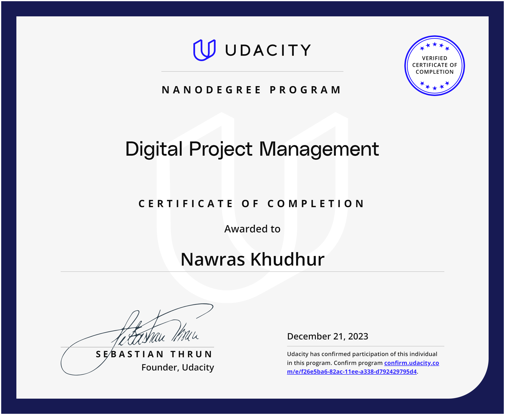

# Udacity Digital Project Management Nanodegree Program
[Link to the official certificate](confirm.udacity.com/e/f26e5ba6-82ac-11ee-a338-d792429795d4)

# Materials
This repository contains my notes taken during the Udacity's [Digital Program Management Nanodegree Program](https://www.udacity.com/course/digital-project-management-nanodegree--nd043).

# Overview of the course
* Impact of Digital Project Management:
  * Facilitates online content, product, and service creation for business sustainability and expansion.
  * Utilizes digital tools for project coordination, ensuring timely and budget-friendly completion while meeting business and customer needs.

* Key Skills Taught in the Digital Project Management Nanodegree:
  * Translating business requirements into project scope statements.
  * Developing project plans using Waterfall or Agile methodologies.
  * Building and managing high-performing project teams.

* Nature of the Digital Project Management Nanodegree:
  * Focuses on foundational concepts and contemporary methods.
  * Rapidly growing field impacting diverse industries like retail, media, and technology.

* Final Project - From Methodology to Execution:
  * Project Management Lifecycle Experience: Guides through the entire project management lifecycle.
  * Role as a Project Manager: Assumes the role to facilitate digital transformation for a small family business.
  * Structured Approach: Follows a structured methodology from inception to execution.
